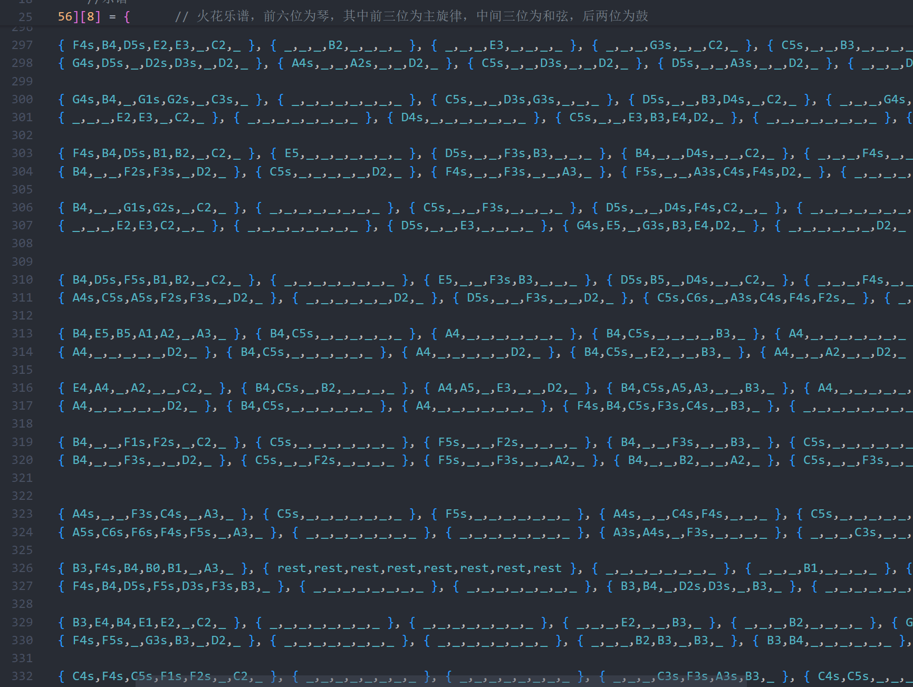

# 手把手教程：用C++写钢琴曲！！

## 写在开头的闲话

那是一个很平凡的一天，我在B站偶然刷到了这样一条视频


视频内容大致是这位UP主使用C++中MIDI相关的函数，写出了一首《起风了》。虽然只有单音的旋律，节奏也不算很稳定，但这引起了我浓厚的兴趣。

我立刻联系到这位同学，了解到他也来自清华，是致理书院的一位二字班学长，并把代码发给了我参考。顺便告诉了我，在CSDN上面有相关的帖子，教程比较详细，可以去看一看。

我在进行了一番研究后，通过一系列方法(下文会提到)改进了代码，使其可以同时产生多音(这样就能实现和弦进行)，甚至可以添加鼓的伴奏，并自行操作扒出了一首耳熟能详的《你的名字》动画电影BGM，`《火花 スパークル (Movie ver.)》--RADWIMPS (ラッドウィンプス)`。感兴趣成品的可以跳转我的B站视频 [这个UP用C++演奏并改编了《火花》！](https://www.bilibili.com/video/BV1oLYue8Egq/?spm_id_from=333.999.0.0&vd_source=4ca7893a81b8933cfb12e7c5e19d25e3 "火花")全长七分钟，喜欢您听！

于是呢就~~水出了~~写出了这篇文章。（其实真的不水，我的大部分时间用来写谱子了，花了我近20小时扒谱子以及手敲谱子对应代码qwq所以还是希望大家能听一听我最后的成果的↑，我会很高兴🥺！另如果有小伙伴也感兴趣，欢迎来文末的github仓库一起玩，请吃疯四/麦麦😋）

## 先尝试让程序发出声音

### 代码部分

在C语言的Win32 API中，有专门用于播放MIDI的API，他们包含在 `windows.h`头文件中，需要链接 `winmm.lib`库才可以使用。而MSVC环境能提供对Win32 API的支持。(下载Visual Studio时自动会下载MSVC环境，但是在VsCode中需要另行配置)因此如果想使用MIDI函数，需要在开头做这些操作

```cpp
#include <iostream>
#include <Windows.h>
#pragma comment(lib,"winmm.lib")
```

想要播放midi，首先要打开midi设备。这就要用到 `midiOutOpen`函数,这个函数可以获取到一个MIDI设备的句柄，方便后续向MIDI设备发送音符、控制信息等MIDI消息。所以我们还先需要给我们的MIDI设备起一个名字，使用 `HMIDIOUT`

```cpp
HMIDIOUT myMidi;
midiOutOpen(&myMidi, 0, 0, 0, 0);
```

我们将 `myMidi`传入 `midiOutOpen`函数。至于具体的函数作用，参考[Microsoft官方文档对此的介绍](https://learn.microsoft.com/en-us/previous-versions//dd798476(v=vs.85))。当然后续所有函数也可以通过这个文档查询，之后就不在赘述。

现在我们有了一个叫 `myMidi`的MIDI设备并且已经打开了，我们可以尝试让它发出声音，使用 `midiOutShortMsg`函数(还有其他函数可以使用，略过)

```cpp
midiOutShortMsg(myMidi, 0x00403C90)
```

这个函数能让 `myMidi`设备发出声音，这个声音由后面8位16进制数作为参数决定。
参数有用的部分只有后面六位，即0x403C90，并且可以拆为三部分

- 第一部分(0x40所在的位置)代表音量，范围是0x0~0x7F，值越大声音就越大
- 第二部分(0x3C所在的位置)代表音阶，范围是0x0~0x7F，其中一部分对应着从A0-C8的音阶，后续会再提到
- 第三部分(0x90所在的位置)代表音色，范围是0x90~0x9F,其中0x99为鼓，其余全是相同的钢琴音色
  为了方便代码管理，我们把这三个部分分别定义，最后位移组合起来即可

```cpp
int voice = 0x0;      // 声音参数
int volume = 0x44;    // 适中音量
int voiceType = 0x90; // 钢琴音色
int note = 48;        // 对应C3,后续会提到
voice = (volume << 16) + (note << 8) + voiceType; //组合出来的声音参数
midiOutShortMsg(myMidi, voice); // 向设备发送这个声音
```

这时候如果你运行程序，并不会有声音出来，这是因为程序在发声瞬间就结束了，我们还需要 `Sleep`函数来配合

```cpp
int sleep = 1000;    //每个音符的时长(ms)
Sleep(sleep);
```

最后记得关闭打开的MIDI设备

```cpp
midiOutClose(myMidi);
```

自此我们完成了第一步，让程序发出C3的钢琴音。总代码:

```cpp
#include <iostream>
#include <Windows.h>
#pragma comment(lib,"winmm.lib")
int main()
{
	HMIDIOUT myMidi;
	midiOutOpen(&myMidi, 0, 0, 0, 0);
	int voice = 0x0;      // 声音参数
	int volume = 0x44;    // 适中音量
	int note = 48;        // 对应C3,后续会提到
    	int voiceType = 0x90; // 钢琴音色
	voice = (volume << 16) + (note << 8) + voiceType; //组合出来的声音参数
	midiOutShortMsg(myMidi, voice); // 向设备发送这个声音
	int sleep = 1000;     //每个音符的时长(ms)
	Sleep(sleep);
	midiOutClose(myMidi);
}
```

### 写谱准备

我们目前能让程序发出声音了，而距离写出旋律还需要一些准备工作。
刚刚提到，voice参数的第二个部分控制音阶，具体的对应关系已经有大佬给出了
为了方便后续写谱，我们直接定义一个枚举类型，将数字与对应音阶名字对应起来
(音阶名后面的小s代表升号)

```cpp
enum Scale
{
    C8 = 108, B7 = 107, A7s = 106, A7 = 105, G7s = 104, G7 = 103, F7s = 102, F7 = 101, E7 = 100,
    D7s = 99, D7 = 98, C7s = 97, C7 = 96, B6 = 95, A6s = 94, A6 = 93, G6s = 92, G6 = 91, F6s = 90, F6 = 89,
    E6 = 88, D6s = 87, D6 = 86, C6s = 85, C6 = 84, B5 = 83, A5s = 82, A5 = 81, G5s = 80, G5 = 79, F5s = 78,
    F5 = 77, E5 = 76, D5s = 75, D5 = 74, C5s = 73, C5 = 72, B4 = 71, A4s = 70, A4 = 69, G4s = 68, G4 = 67,
    F4s = 66, F4 = 65, E4 = 64, D4s = 63, D4 = 62, C4s = 61, C4 = 60, B3 = 59, A3s = 58, A3 = 57, G3s = 56,
    G3 = 55, F3s = 54, F3 = 53, E3 = 52, D3s = 51, D3 = 50, C3s = 49, C3 = 48, B2 = 47, A2s = 46, A2 = 45,
    G2s = 44, G2 = 43, F2s = 42, F2 = 41, E2 = 40, D2s = 39, D2 = 38, C2s = 37, C2 = 36, B1 = 35, A1s = 34,
    A1 = 33, G1s = 32, G1 = 31, F1s = 30, F1 = 29, E1 = 28, D1s = 27, D1 = 26, C1s = 25, C1 = 24, B0 = 23,
    A0s = 22, A0 = 21, _ = 0xFF
};
```

然后我们可以这样写谱

```cpp
int score[20] = {
    E3, E3, F3, G3, G3, F3, E3, D3, C3, C3, D3, E3, E3, D3, D3
};
for(int i = 0; i < 20; i++)
{
    voice = (volume << 16) + (score[i] << 8) + voiceType;
    midiOutShortMsg(myMidi, voice);
    Sleep(sleep);
}
```

有一定乐理基础的同学应该可以看出来上面这段程序弹出了一小段欢乐颂。
由此，如果给我们许多时间写谱，就能写出我开头图片中所显示的那位UP主的《起风了》因为他也是这样纯单音演奏出的旋律。

## 多音演奏的探索

其实网上大多的教程，在上一步教你发出声音就结束了，但一次只能弹一个音对我来说还是有点不太满意。
接下来我们来探索如何同时发出多个音，这样就能创作出更加动听的歌曲了！

我曾天真地想着，用两个 `midiOutShortMsg`函数不就好了

```cpp
voice = (volume << 16) + (note1 << 8) + voiceType;
midiOutShortMsg(myMidi, voice);
voice = (volume << 16) + (note2 << 8) + voiceType;
midiOutShortMsg(myMidi, voice);
```

这样的结果是，只会发出最后一个声音，即note2代表的声音
分析原因可能是一个midi设备只支持一个通道
那开两个midi设备不就好了？
我又如是写到

```cpp
HMIDIOUT myMidi1;
HMIDIOUT myMidi2;
midiOutOpen(&myMidi1, 0, 0, 0, 0);
midiOutOpen(&myMidi2, 0, 0, 0, 0);
voice = (volume << 16) + (note1 << 8) + voiceType;
midiOutShortMsg(myMidi1, voice);
voice = (volume << 16) + (note2 << 8) + voiceType;
midiOutShortMsg(myMidi2, voice);
Sleep(sleep);
```

结果还是只发出note2代表的声音
本人拥有的知识面限制着我上网搜索文档的步伐，搜到的解决方案大多看不懂
无意间我注意到voiceType范围为0x90~0x9f,其中只有0x99为鼓
于是我不抱希望地将程序写成这样

```cpp
voice = (volume << 16) + (note1 << 8) + voiceType;
midiOutShortMsg(myMidi, voice);
voice = (volume << 16) + (note2 << 8) + voiceType+1; //使用另一种钢琴音色
midiOutShortMsg(myMidi, voice);
```

结果还真发出了note1和note2两个声音，神奇！(有了解原理的欢迎告诉被蒙在鼓里的我🥺)
另外我还未实践的多线程方法不知是否可行，不过我感觉多线程可能会很难同步

总之，思路一下子打开了
我将数组重新定义，并重新写了程序如下

```cpp
int score[20][3] = {
    {E4, C2, C3}, {E4, _, _,}, {F4, _, _,}, {G4, _, _,},
    {G4, G2, G3}, {F4, _, _,}, {E4, _, _,}, {D4, _, _,}, 
    {C4, F2, F3}, {C4, _, _,}, {D4, _, _,}, {E4, _, _,}, 
    {E4, G2, G3}, {D4, _, _,}, {D4, _, _,}, 
};
int sleep = 400;
for(int i = 0; i < 20; i++)
{
    voice = (volume << 16) + (score[i][0] << 8) + voiceType;
    midiOutShortMsg(myMidi, voice);
    voice = (volume << 16) + (score[i][1] << 8) + voiceType+1;
    midiOutShortMsg(myMidi, voice);
    voice = (volume << 16) + (score[i][2] << 8) + voiceType+2;
    midiOutShortMsg(myMidi, voice);
    Sleep(sleep);
}
```

我定义了二维数组作为乐谱，有乐理基础的同学可以看到我不过是在下面加了一个八度音垫一下而已
就像预期那样，程序终于发出了多个音，听起来美妙了很多，可喜可贺！
不过出现了问题，这个程序发出的和弦只存在一拍，究其根源就是我在不弹的时候使用了 `_`
而看对照关系发现 `_=0xFF`会让程序不发音，在音乐中叫休止，如果只弹一拍就休止的话听起来还是很“丑”的
我又试了很久，发现了一点:`-2`这个数传进去后会产生延音的效果，`0xFF`则是休止。
于是我个人将Scale音阶对应表更新如下(改变了结尾的_和rest):

```cpp
enum Scale
{
    C8 = 108, B7 = 107, A7s = 106, A7 = 105, G7s = 104, G7 = 103, F7s = 102, F7 = 101, E7 = 100,
    D7s = 99, D7 = 98, C7s = 97, C7 = 96, B6 = 95, A6s = 94, A6 = 93, G6s = 92, G6 = 91, F6s = 90, F6 = 89,
    E6 = 88, D6s = 87, D6 = 86, C6s = 85, C6 = 84, B5 = 83, A5s = 82, A5 = 81, G5s = 80, G5 = 79, F5s = 78,
    F5 = 77, E5 = 76, D5s = 75, D5 = 74, C5s = 73, C5 = 72, B4 = 71, A4s = 70, A4 = 69, G4s = 68, G4 = 67,
    F4s = 66, F4 = 65, E4 = 64, D4s = 63, D4 = 62, C4s = 61, C4 = 60, B3 = 59, A3s = 58, A3 = 57, G3s = 56,
    G3 = 55, F3s = 54, F3 = 53, E3 = 52, D3s = 51, D3 = 50, C3s = 49, C3 = 48, B2 = 47, A2s = 46, A2 = 45,
    G2s = 44, G2 = 43, F2s = 42, F2 = 41, E2 = 40, D2s = 39, D2 = 38, C2s = 37, C2 = 36, B1 = 35, A1s = 34,
    A1 = 33, G1s = 32, G1 = 31, F1s = 30, F1 = 29, E1 = 28, D1s = 27, D1 = 26, C1s = 25, C1 = 24, B0 = 23,
    A0s = 22, A0 = 21, _ = -2, rest = 0xFF
};
```

这下思路真的完全打开了，我们可以迈向更远大的目标了

## 开始实现完整音乐

一首完整的音乐，我们需要考虑它的拍号，情绪，速度。以及最基本的每个音符的音阶，节奏，时长
此部分就来一步一步解决所有问题，最后呈现出美妙的音乐（瓦库瓦库

- 拍号、速度和音符时值

拍号是指一个小节的拍数以及一拍的时长。
那么在程序中引入这个定义实际只是为了便于代码管理，与编写过程中的调试
比如我们定义

```cpp
int beatPerSection = 4; // 每小节拍数
int notePerBeat = 3;    // 每拍音符数
int sleep = 100;        // 每个音符的时值
```

这里这个sleep的值其实就取决于你要扒的曲子的速度，以及这个曲子里所包含的最短的音符
就拿我扒的《火花》为例，它是一首12/16拍的歌，BPM为124
即它以16分音符为一拍。我在浏览谱子后，并没有比16分音符时值更低的音符，所以我们就以一个16音符为单位。
BPM为124，则每秒有124/60拍，每拍三个16分音符，则每个16分音符长度为161.3(ms)实际听后发现太慢了，最终调为了148
后来我在写程序的时候给他简化为了一小节有4拍，每拍3个音符。

- 音符

我们确定了一个音符单位，就可以表示出所有音符了。
可以根据音符功能分为多个部分，我将其分为旋律部分和和弦部分
分为两个数组分别存储，也可以直接设一个总数组。

1. 定义总谱数组
   这种方法是我用的方法，优点是便于对齐两个部分
   缺点很明显，就是和弦部分音符出现频率没有旋律部分那么高，因此这个谱子里会打上大量的 `_`

```cpp
int flame[2256][8] = {      // (节选)火花乐谱，前六位为琴，其中前三位为主旋律，中间三位为和弦，后两位为鼓
        /*160*/ { E4,E5,_,E2,E3,_,_,_ }, { F4s,F5s,_,B2,_,_,_,_ }, { E4,E5,_,E3,_,_,_,_ }, // 这样的一行 为一拍
                { B4,B5,_,G3s,_,_,_,_ }, { G4s,G5s,_,B3,_,_,_,_ }, { B4,B5,_,E3,_,_,_,_ },
                { G4,G5,_,D2s,D3s,_,_,_ }, { A4s,A5s,_,A2s,_,_,_,_ }, { C5s,C6s,_,D3s,_,_,_,_ }, 
                { D5s,D6s,_,A3s,_,_,_,_ }, { _,_,_,C4s,_,_,_,_ }, { A4s,_,_,D4s,_,_,_,_ },
            //这四拍是一个小节
/*这是小节号161*/{ D4s,G4s,B4,G1s,G2s,_,_,_ }, { _,_,_,_,_,_,_,_ }, { _,_,_,D3s,_,_,_,_ }, 
                { F5s,_,_,B3,D2s,_,_,_ }, { _,_,_,G3s,_,_,_,_ }, { D5s,_,_,B3,_,_,_,_ },
                { B4,E5,_,E2,E3,_,_,_ }, { _,_,_,_,_,_,_,_ }, { _,_,_,E3,_,_,_,_ }, 
                { E5,_,_,B3,E4,_,_,_ }, { _,_,_,_,_,_,_,_ }, { E5,_,_,E3,_,_,_,_ },

        /*162*/ { B4,D5s,_,B1,B2,_,_,_ }, { E5,_,_,F3s,_,_,_,_ }, { D5s,_,_,B3,_,_,_,_ }, 
                { B4,_,_,B3,D4s,_,_,_ }, { _,_,_,F3s,_,_,_,_ }, { D5s,_,_,B3,D4s,_,_,_ },
                { F4s,B4,_,F2s,F3s,_,_,_ }, { B4,_,_,_,_,_,_,_ }, { F4s,_,_,F3s,_,_,_,_ }, 
                { B4,D5s,_,C3s,_,_,_,_ }, { D5s,F5s,_,B1,B2,_,_,_ }, { A4s,A5s,_,A1s,A2s,_,_,_ },

        /*163*/ { B4,G5s,B5,G1s,G2s,_,_,_ }, { _,_,_,_,_,_,_,_ }, { F3s,_,_,_,_,_,_,_ },
                { F5s,F6s,_,D4s,F4s,_,_,_ }, { _,_,_,_,_,_,_,_ }, { D5s,D6s,_,B3,_,_,_,_ },
                { E5,B5,E6,E2,E3,_,_,_ }, { _,_,_,_,_,_,_,_ }, { _,_,_,E3,_,_,_,_ },
                { G5s,G6s,_,G3s,B3,E4,_,_ }, { _,_,_,_,_,_,_,_ }, { E3,_,_,_,_,_,_,_ },};
```

2. 将旋律和和弦分别存储(不演示)
   优点是可以分部分完成扒谱，先扒旋律，再扒和弦，以及空间利用率较高
   缺点就是想让两部分对齐的话可能看的眼花花的，需要认真做好注释，这样会好找

```cpp
int melody[8432] = {...};     // 旋律部分
int chords[8432] = {...};     // 和弦部分
int drum[8432] = {...};       // 鼓部分
```

除此之外一定还有别的好方法
黑猫白猫，抓到老鼠就是好猫！欢迎探索！

- 情绪

我简单使用音量的调节实现了情绪的改变。

```cpp
int rhyVolume;          // 旋律音量，范围为0x0~0x7f
int choVolume;          // 和弦音量
//int drumVolume;       // 鼓音量
int currentSection = 0; // 当前小节，请自行在循环中添加自增代码，本例没有
//音量控制
switch (currentSection)      //在特定的小节处控制音量
    {
    case 111:
    case 112:rhyVolume = 0x34; choVolume = 0x55; break;
    case 119:choVolume = 0x30; break;
    case 120:choVolume = 0x44; break;
    case 129:choVolume = 0x35; break;
    case 130:choVolume = 0x45; break;
    case 131:choVolume = 0x55; break;
    case 187:rhyVolume = 0x32; break;
    case 188:rhyVolume = 0x20; break;
    default:
        rhyVolume = 0x42;
        choVolume = 0x70;
        //drumVolume = 0x52;
        break;
    }
```

嗯对，十分地简单粗暴

- 音乐进行

前面提到过，在 `for`循环里不断给 `voice`赋值然后传入 `midiOutShortMsg`函数就可实现音乐的进行。
不过为了扒谱，调试，试听等多环节的方便，我们可以采取这样的结构

```cpp
int startSection = 77;   // 起始小节位置
int endSection = 188;   // 结束小节位置
int beatPerSection = 4; // 拍数
int notePerBeat = 3;    // 每拍音符数
int note = notePerBeat*beatPerSection*startSection; // 起始音符的位置
int currentSection = note / (notePerBeat*beatPerSection); // 当前小节
for (; note < notePerBeat*beatPerSection*endSection; note++)
{
    // 小节数计算和显示部分
    if (note % 12 == 0)
    {
        printf("\n");
        currentSection++;
        printf("Section %d\t", currentSection);
    }

    // 音量控制部分
    switch (currentSection)      //在特定的小节处控制音量
    {...}

    // 音符输出部分
    voice = (rhyVolume << 16) + ((score[note][0]) << 8) + voiceType;
    midiOutShortMsg(myMidi, voice);
    voice = (rhyVolume << 16) + ((score[note][1]) << 8) + voiceType+1;
    midiOutShortMsg(myMidi, voice);
    ...

    // 音符长度部分
    Sleep(sleep);

    //节奏可视化部分
    if (flame[note][0] != _)
        printf("%d ", flame[note][0]);
    else printf("   ");
    if (flame[note][1] != _)
        printf("%d ", flame[note][1]);
    else printf("   ");
    ...

}
```

这样，如果我们需要从第20小节开始听，听到第40小节，就可以直接修改startSection和endSection的值
十分便于调试

## C++钢琴曲实战练习

说来咱就来，我花巨量的时间扒出了你的名字电影中的《火花》。这首歌算是我最喜欢的一首之一了。
大致流程其实就是写出代码框架，然后使劲往flame这个数组中写音符。歌曲中的每一秒都会有约2拍
2拍就是约6个16分音符，每个音符我又设置了8个通道，前六个为琴，后两个为鼓
而每个音符都需要自己手动敲上去，最终成品约7分钟，算下来7x60x2x3x8一共手敲20160个音符


由此可见这个过程需要巨大的耐心和闲心。~~可笑的是我两者兼具~~

对音频感兴趣的可以跳转[我的bilibili视频](https://www.bilibili.com/video/BV1oLYue8Egq/?spm_id_from=333.999.0.0&vd_source=4ca7893a81b8933cfb12e7c5e19d25e3 "火花")
对代码感兴趣的同学可以跳转[我的github仓库](https://github.com/JaderOx/Weekly-C-Music "火花")
里面有README.md文件，可以根据那个一步步在自己电脑上部署代码并播放

### 最后再不抱希望地希望一下

大家有感兴趣的可以一起来仓库玩儿，一起扒谱

~~我什么都会做的~~
